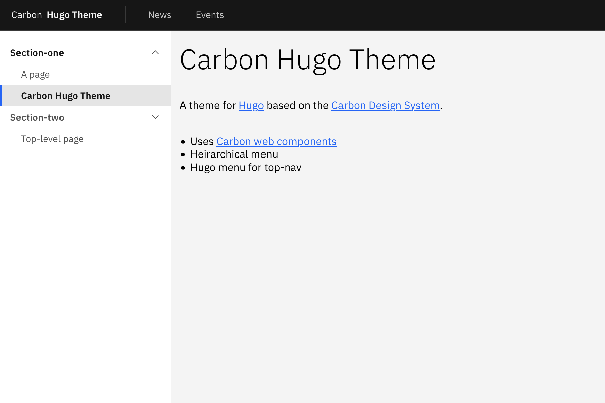

# Carbon theme for hugo

Carbon theme for hugo static site generator

Making use of [Carbon](https://carbondesignsystem.com/) for [Hugo](https://gohugo.io/) static sites. 

 - Support for Instana EUM (just set params > instanaKey)
 - Support for theme selection (params > cdstheme) - supports `white`, `g10`, `g90` and `g100` 
 - Support for preferred theme switching - specify lighttheme and darktheme in parameters from the options above
 - Support for embedding pagefind search (set search to true in parameters)