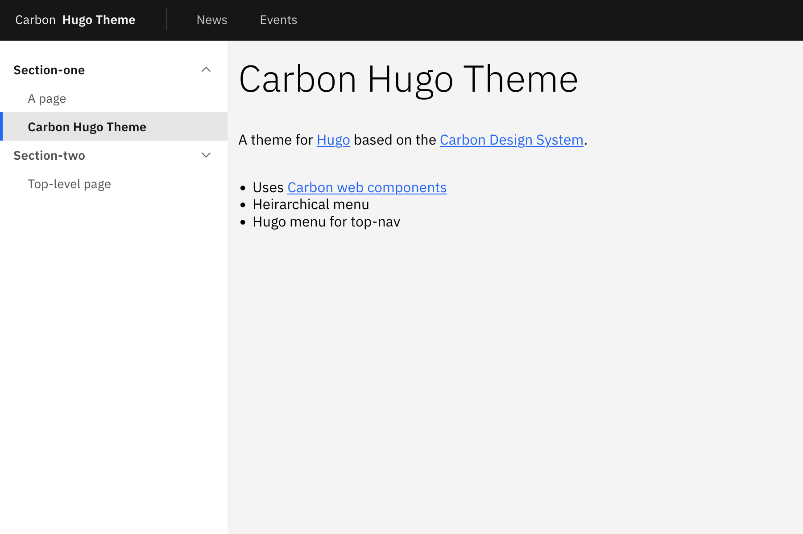

# Carbon theme for hugo

Carbon theme for hugo static site generator

Making use of [Carbon](https://carbondesignsystem.com/) for [Hugo](https://gohugo.io/) static sites. 

- Support for Instana EUM (just set params > instanaKey)
- Support for theme selection (params > cdstheme) - supports `white`, `g10`, `g90` and `g100` 
- Support for preferred theme switching - specify lighttheme and darktheme in parameters from the options above
- Support for embedding pagefind search (set search to true in parameters)

## Configuration

The carbon theme for hugo supports the following configuration options:

### Theme selection

The carbon theme for hugo supports the selection of a [Carbon theme](https://carbondesignsystem.com/elements/themes/overview/) to adjust the appearance of your site or dynamically switching between light and dark themes based on the `prefers-color-scheme` provided by the users browser:

- `cdstheme` - default carbon theme to use for the site - valid options are `white`,  `g10`, `g90` and `g100`
- `darktheme` - theme to use if the user's browser indicates they prefer a dark theme
- `lighttheme` - theme to use if the user's browser indicates they prefer a light theme

### Instana End User Monitoring

Get insights into your sites performance and usage through [Instana Website Monitoring](https://www.google.com/url?sa=t&source=web&rct=j&opi=89978449&url=https://www.ibm.com/docs/en/instana-observability/current%3Ftopic%3Dinstana-monitoring-websites) Specify your instana key to get observability for your site - first set up an application in your Instana instance and then add the key to your properties in `instanaKey`

### Appearance options

- `sidenav` - turn off the side nav by setting this to false
- `sidemenu` - Within the side navigation you can choose to either generate the list automatically by setting this to `auto` otherwise the main menu will be used.
- `favicon` - path to the favicon to display
- `siteicon` - path to the siteicon to display
